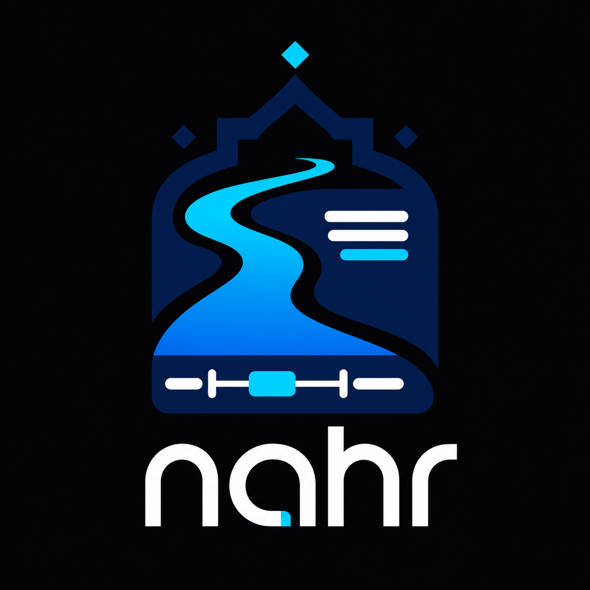

<p align="center">
  
</p>

<h1 align="center">𝓷𝓪𝓱𝓻</h1>

<p align="center">
  A Rust CLI for transcribing video, translating subtitles into Simplified Chinese, and burning them into a new MP4.
</p>

## What This Project Does

Given one input MP4, the pipeline does:

1. Extract audio to WAV (`16kHz`, `mono`, `16-bit PCM`)
2. Run VAD + Whisper to generate source subtitles (`.<lang>.srt`)
3. Translate subtitles to Simplified Chinese (`.cn.srt`)
4. Burn Chinese subtitles into a new MP4
5. Remove temporary WAV/SRT files unless `--keep-temp` is enabled

Output video name:

- `<input_stem>_cn_bake.mp4`

## Requirements

- Rust toolchain
- Python 3.9+
- `ffmpeg` executable
- FFmpeg built with `libass` (required by `subtitles` filter)

Verify FFmpeg:

```bash
ffmpeg -version
ffmpeg -filters | grep subtitles
```

## Quick Start

### 1) Clone

```bash
git clone https://github.com/MichaelScofield111/nahr.git
cd nahr
```

### 2) Download models

```bash
mkdir -p models

# Whisper model (default path used by CLI)
curl -L "https://huggingface.co/ggerganov/whisper.cpp/resolve/main/ggml-base.bin" \
  -o models/ggml-base.bin

# VAD model (default path used by CLI)
curl -L "https://huggingface.co/ggml-org/whisper-vad/resolve/main/ggml-silero-v5.1.2.bin" \
  -o models/ggml-silero-v5.1.2.bin
```

### 3) Build

Install Python translation dependencies:

```bash
cd script
python3 -m venv .venv
source .venv/bin/activate
pip install -U pip
pip install torch transformers srt
cd ..
```

Then build Rust:

```bash
cargo build --release
```

### 4) Run

```bash
cargo run --release -- \
  --input-file assets/example.mp4 \
  --language en
```

Or even shorter, since English is already the default:

```bash
cargo run --release -- --input-file assets/example.mp4
```

If you want to keep temporary `.wav/.srt` files:

```bash
cargo run --release -- \
  --input-file assets/example.mp4 \
  --language en \
  --whisper-model-path models/ggml-base.bin \
  --vad-model-path models/ggml-silero-v5.1.2.bin \
  --keep-temp
```

## CLI Arguments

- `--input-file <FILE>`: Input MP4 file (required)
- `--language <LANG>`: Source language (`en` default, translation supports `en` and `ja`)
- `--keep-temp`: Keep intermediate WAV/SRT files

Advanced options still exist for custom setups, but the default workflow does not require passing model/script paths explicitly.

## Intermediate Files

For input `demo.mp4` with `--language en`, temporary files are:

- `demo.wav`
- `demo.en.srt`
- `demo.en.cn.srt`

## Troubleshooting

### `failed to extract wav ... Stream not found`

Reason: your input video has no audio stream.

Check streams:

```bash
ffprobe -v error -show_entries stream=index,codec_type,codec_name -of compact input.mp4
```

You need an MP4 that contains at least one audio stream.

### VAD / Whisper model load failure

Check:

- File exists and is readable
- `--whisper-model-path` points to a Whisper GGML model (for example `ggml-base.bin`)
- `--vad-model-path` points to a VAD model (for example `ggml-silero-v5.1.2.bin`)

### `ffmpeg failed to burn subtitles`

Possible reasons:

- FFmpeg missing
- FFmpeg without `libass`
- Subtitle path escaping/permissions issue

### Translator script failed

Check:

- `python3` is available, or pass `--python-bin <path>`
- `script/trans.py` exists, or pass `--translator-script-path <path>`
- Python dependencies are installed
- The translation model can be downloaded or already exists in local cache

## Notes

- `models/` is ignored by git; do not commit model binaries.
- First translation run may download model assets required by `transformers`.
- Keep original input videos as backup; burn-in rewrites output video.
